# Personal portfolio
Personal portfolio website

- [Personal portfolio](#personal-portfolio)
    - [Requisitos](#requisitos)
  - [Instalación del entorno](#instalación-del-entorno)
    - [Instalación de entorno preconfigurado](#instalación-de-entorno-preconfigurado)
    - [Instalación individual de dependencias](#instalación-individual-de-dependencias)
  - [Build](#build)
    - [Gulp y el gulpfile](#gulp-y-el-gulpfile)
      - [Cabecera del fichero](#cabecera-del-fichero)
      - [Arranque del servidor](#arranque-del-servidor)
      - [Copiado de los ficheros .html](#copiado-de-los-ficheros-html)
      - [Procesado de los ficheros .sass](#procesado-de-los-ficheros-sass)
      - [Procesado de los ficheros .js](#procesado-de-los-ficheros-js)
      - [Observando los cambios](#observando-los-cambios)
      - [Forzar a los navegadores actualizar su cache](#forzar-a-los-navegadores-actualizar-su-cache)
      - [Juntando todas las partes](#juntando-todas-las-partes)
  - [Usando el entorno de desarrollo](#usando-el-entorno-de-desarrollo)
    - [Configuraciones básicas](#configuraciones-básicas)
    - [Inyectar html externo](#inyectar-html-externo)
    - [Usar elementos de bootstrap](#usar-elementos-de-bootstrap)
    - [Usar browser sync](#usar-browser-sync)
- [Referencias](#referencias)
- [Anexos](#anexos)

### Requisitos

Para usar este entorno es necesario el entorno de ejecución de **Node JS**. Nodejs  es un entorno que incluye todo lo necesario para ejecutar javascript en nuestro ordenador. Por ejemplo, los navegadores tienen sus propios entornos para ejecutar javascript pero no están diseñados para trabajas como lo está nodejs, que entre otras cosas incluye **npm**, un gestor de paquetes (piezas de software instalables).

Para instalar node, en su pagina oficial están disponibles las ultimas versiones, las **LTS** (Long Term Support, "Se ofrece soporte a esta version durante más meses") son generalmente más estables mientras que las ultimas versiones pueden presentar incidencias o no.

## Instalación del entorno

### Instalación de entorno preconfigurado
Tenemos varias opciones a la hora de instalar las dependencias necesarias para nuestro entorno. La primera es disponer de un fichero **package.json** que incluirá la lista de paquetes que necesitamos para ejecutar nuestro entorno, algunos de ellos no serán necesarios en producción, estos se incluirán en **devDependencies**.

    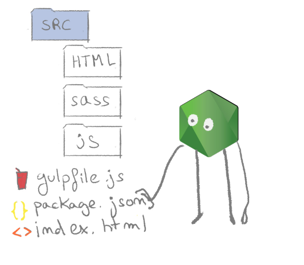
     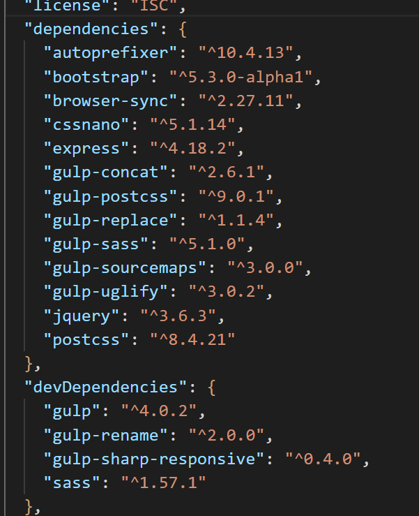

Ya que disponemos de dicho fichero, basta con ejecutar el siguiente comando en la raiz de nuestro proyecto, esto es, donde se encuentre nuestro fichero **package.json**. 

`npm install`

Entonces node procederá a descargar todos estos paquetes y añadirlos en la carpeta **node_modules**.

    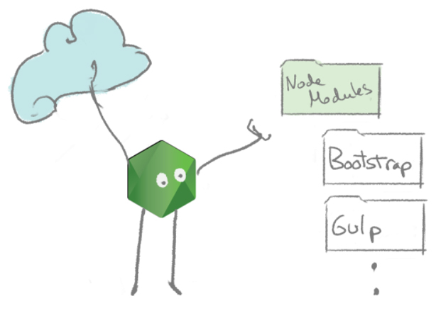
 

### Instalación individual de dependencias 

Puesto que no disponemos de un fichero **package.json** que especifique las dependencias de nuestro proyecto comenzaremos por crear uno ejecutando el siguiente comando en la raiz de nuestro proyecto.

`npm init`

Respondemos a los datos que nos solicite la consola hasta finalizar la interacción.

El siguiente paso será instalar el cliente de **gulp** ejecutando el siguiente comando.

`npm install -g gulp-cli`    

En la raiz de nuestro proyecto, podemos encontrar un fichero de nombre **gulfile.js**, si nos fijamos en sus primeras lineas veremos lo siguiente, muchas declaraciónes de variables usando la función require, esto son dependencias que tendremos que instalar.

    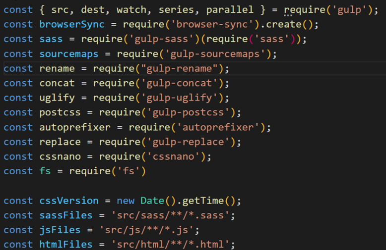

Las siguientes librerías solo se utilizarán en el entorno de desarrollo.

`npm install --save-dev gulp gulp-sharp-responsive`
`npm install --save-dev gulp-rename`
`npm install --save-dev sass`         

Finalmente instalamos todas las dependencias necesarias de la siguente forma.

`npm install -d gulp browser-sync gulp-sass gulp-sourcemaps gulp-concat gulp-uglify gulp-postcss autoprefixer gulp-replace cssnano bootstrap jquery`

**Nota**
Otras librerías que puede hacer falta instalar:

Es posible que haga falta instalar esta libería en algunos casos. En la consola y como administrador ejecutar el siguiente comando.
`npm install --global windows-build-tools`

Si tenemos problemas con esta librería podeis probra a usar esta versión.
`npm install --global windows-build-tools@4.0.0`

## Build

Nuestro proyecto tendrá inicialmente una estructura como la siguiente, una carpeta con las fuentes de nuestro programa, de nombre src, y dentro los ficheros de javascript, sass y html, cada uno bajo una carpeta con los mismos nombres. Usaremos el programa gulp para leer todo los ficheros en **src** y crear una carpeta de nombre **build**. Esta carpeta puede ser eliminada sin problemas ya que se crea otra vez con el comando **bulk**.

    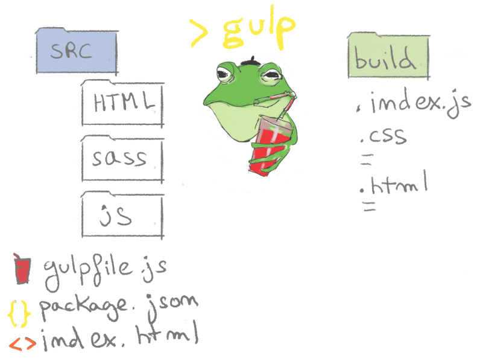

Ejecutamos el siguiente comando en nuestro proyecto para hacer el build.

`gulp`

Si todo va correctamente veremos la siguiente salida en la consola y se creará la carpeta build en la raiz de nuestro proyecto.

    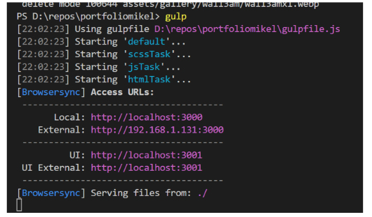

### Gulp y el gulpfile

#### Cabecera del fichero
El progama bulk, es un programa diseñado para ejecutar tareas de acuerdo a una configuración específica, dicha configuración se define en el fichero **bulkfile.js**, que es a su vez un script que se ejecuta siempre que usamos el comando bulk, veamoslo.

La primera parte del fichero ya la conociamos, aquí se definen variables globales y dependencias. 

    

Caben destacar, los selectores que nos permitiran especificar, en nuestro caso, donde tienen que buscarse las fuentes. Por ejemplo, con <b>src/sass/**/*.sass</b> estamos indicando que busque en todas las carpetas bajo la carpeta sass, todos los ficheros que terminen en .sass.

    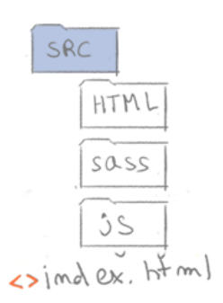
    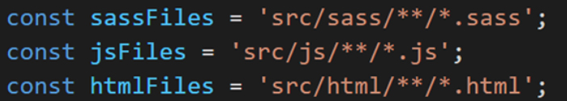

#### Arranque del servidor

Las siguientes líneas del bulkfile sirven para levantar el servidor en la raiz de nuestro proyecto, donde se encuentra el fichero index.html. Si nos fijamos, esto no es una función sino una llamada a la función init de browsersync, esto quiere decir que el servidor se levantará siempre que ejecutemos el comando bulk, independientemente de la tarea que queramos ejecutar.

    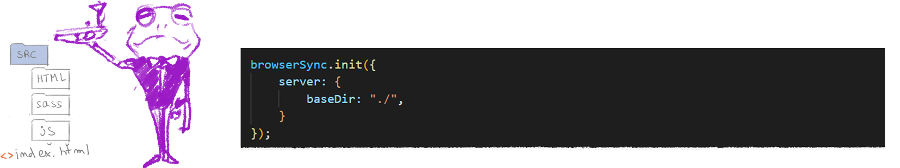

 

#### Copiado de los ficheros .html

La tarea especificada debajo se encarga de copiar los ficheros html de nuestra carpeta hmtl (definida arriba) y pegarlos en la carpeta build.

    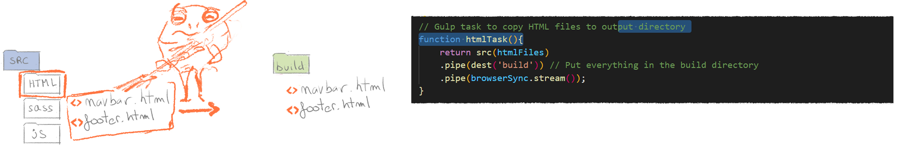

#### Procesado de los ficheros .sass 
La siguiente tarea es algo más compleja, ya que realiza varias acciones. El orden es el siguiente:
- Crea los ficheros css.map, Estos nos permitiran inspecionar los css en el navegador. 
- Se compilan los ficheros sass en ficheros css
- se procesan los ficheros css añadiendo prefijos para mejorar la compatibilidad con distintos navegadores y dispositivos.
- se reduce su tamaño eliminando espacios y modificando nombres de variables.
- finalmente se añaden en la carpeta build.
 

    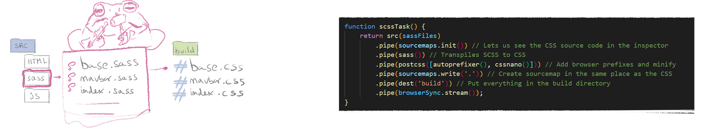

#### Procesado de los ficheros .js 

En esta tarea, se reduce el tamañano de todos los ficheros de javascript y se concatenan formando un único fichero de javascript de nombre index.js, este fichero se añade como siempte, a nuestra carpeta build.:

    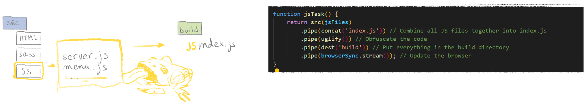

#### Observando los cambios

Esta tarea se encarga de observar cambios en las carpetas fuente cuando el servidor está levantado, en caso de detectar cambios, ejecutará la tarea correspondiente actualizando nuestra carpeta build automáticamente.

    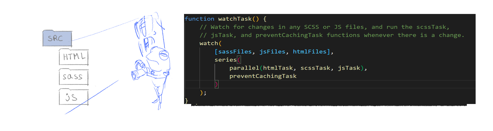

#### Forzar a los navegadores actualizar su cache

Un problema comun, es no tener claro si nuestros cambios han sido aplicados o es el navegador quien está utilizando una version antigua de nuestro programa. Una solucción a esto es pulsar F5, lo que refresca el navegador y su memoria cache. Otra es nombrar los ficheros con la etiqueta *?v=232023* y algún número de versión. Entonces, gulp incrementará dichos números con cada build, forzando al navegador a actualizar su memoria cache y evitando las dudas y trabajo de pulsar F5.

    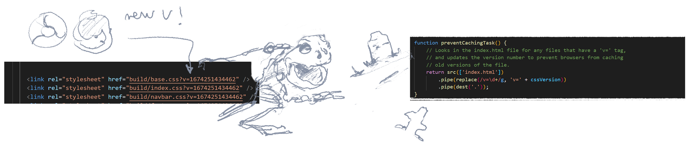

#### Juntando todas las partes
En resumen, tras lanzar el comando gulp tendremos un entorno de desarrollo con un servidor de aplicación local y nuestra cuadrilla de ranas mantendrá el build actualizado a medida que apliquemos cambios, todo de forma automática.

    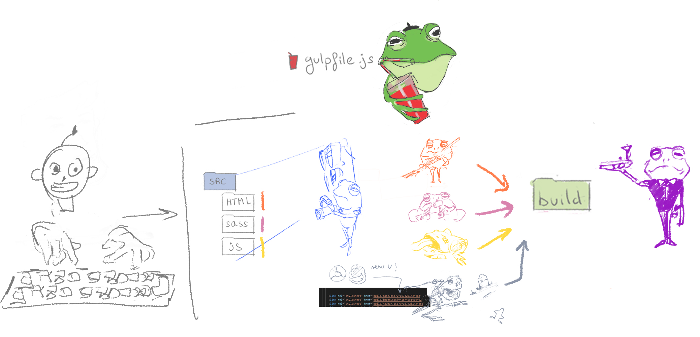

## Usando el entorno de desarrollo

### Configuraciones básicas

Los ficheros css se han de referenciar en la cabecera del html, junto con su parametro de versión, el valor inicial es indeferente.

Los mismo haremos con el fichero de JS, pero dado que todos los scripts de javascript están concatenados en uno solo, podemos compartir el mismo en todas las páginas, reduciendo mucho la complejidad de gestionar los scripts a través de nuestra aplicación. Podemos añadirlo con la ultima línea de la imagen.

    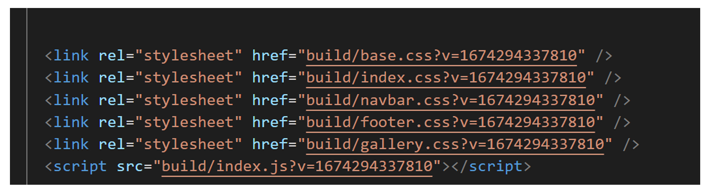

### Inyectar html externo
En el siguiente ejemplo se muestra como podemos inyectar el contenido del los ficheros mediante el uso de jquery. Jquery es una librería que sirve, entre otras cosas para buscar elementos en el html mediante consultas, por ejemplo, "dame todos los list items *li* que sean herederos de la etiqueta con id *foo*". 

En este caso estoy probando con un nuevo html para la barra del navegador, puedo cambiar entre la antigua y la nueva cambiando el comentario de línea.

    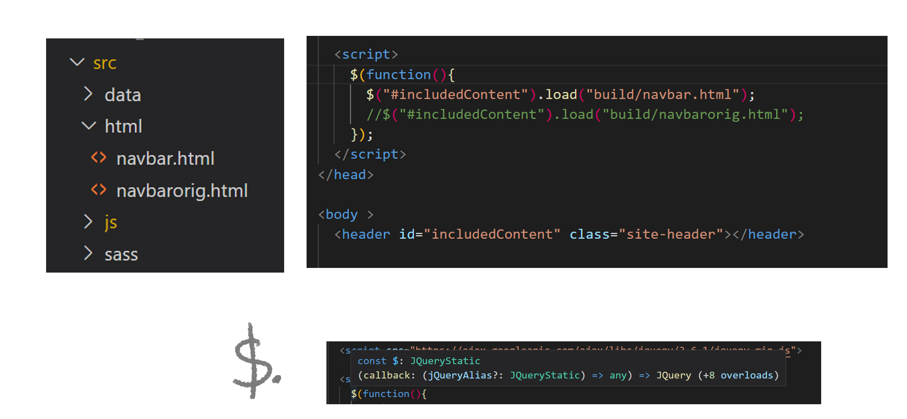

/$. es una función estática de jquery que ejecutará nuestra función cuando todo se haya cargado.

### Usar elementos de bootstrap

<a href="https://getbootstrap.com/docs/5.3/getting-started/introduction/">Bootstrap </a> es una kit de herramientas y contenido html y css. Añadiendo las clases y etiquetas adecuadas, junto con las librerías de bootstrap, podemos crear páginas de una forma más fácil y rápida, garantizando una funcionalidad más estable y estandar, ya que se más gente la está usando. Además, podemos personalizar los estilos por nuestra cuenta más tarde.

Para utilizar bootstrap tenemos que importar a nuestro fichero de sass el archivo bootstrap.scss localizado en modulo de bootstrap. Una vez hecho esto, tendremos visibilidad de todas las clases y defininiciones css de bootstrap.

    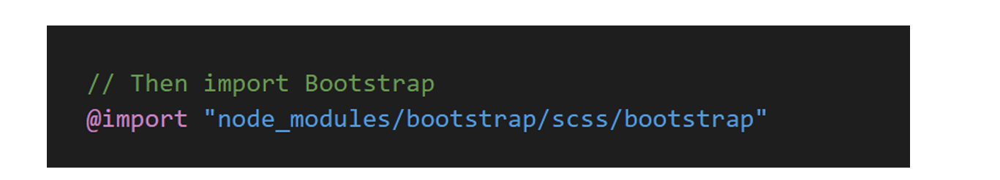

Uno de los htmls que he mostrado en el ejemplo anterior, contenía codigo de bootstrap como el que podeis ver a continuación. Podemos copiarlo de la pagina web de bootstrap e inyectarlo en nuestro html utilizando la estrategia de arriba o añadirlo directamente.

    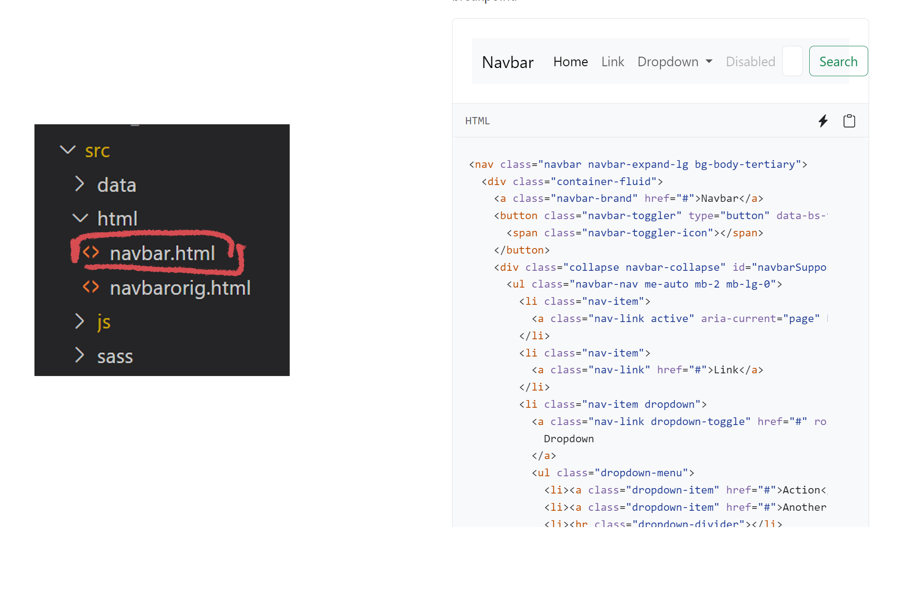

### Usar browser sync

Una vez que hemos levantado el entorno, podremos acceder a nuestra web desde todos los dispositivos en nuestra red. En el puerto 3001, sin embargo, tenemos el panel de Browsersync que nos puede facilitar algunas tareas de maquetación.

    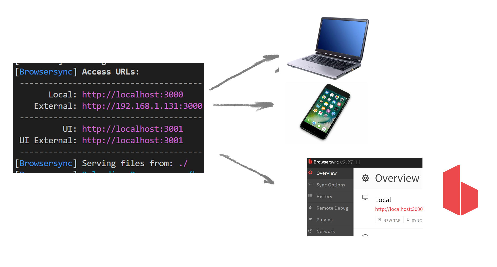

En el apartado **debug**, activando las siguientes opciones veremos los márgenes de los css, sus profundidades, o una malla para configurable para medir distancias.

    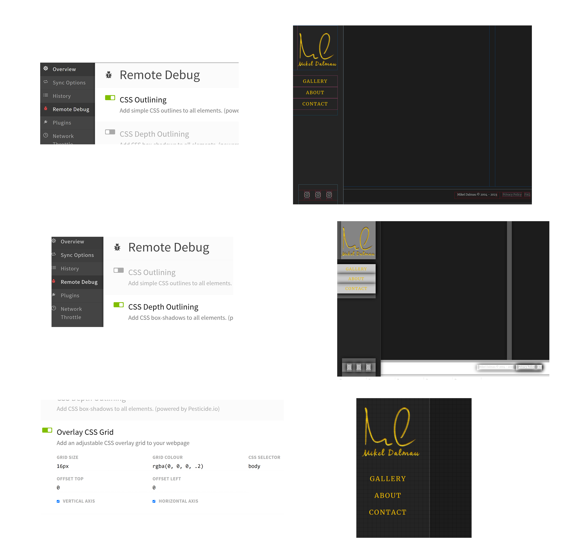

<h2> Gracias por visitarme en gitHub!</h2>

    

# Referencias
https://www.devsamples.com/javascript/example-gulpfile-scss-js-reload
https://docs.npmjs.com/cli/v6/commands/npm-install
https://huemint.com/

# Anexos
Todavía hay más, como habrás podido ver en el gulpfile hay una tarea más definida. 

    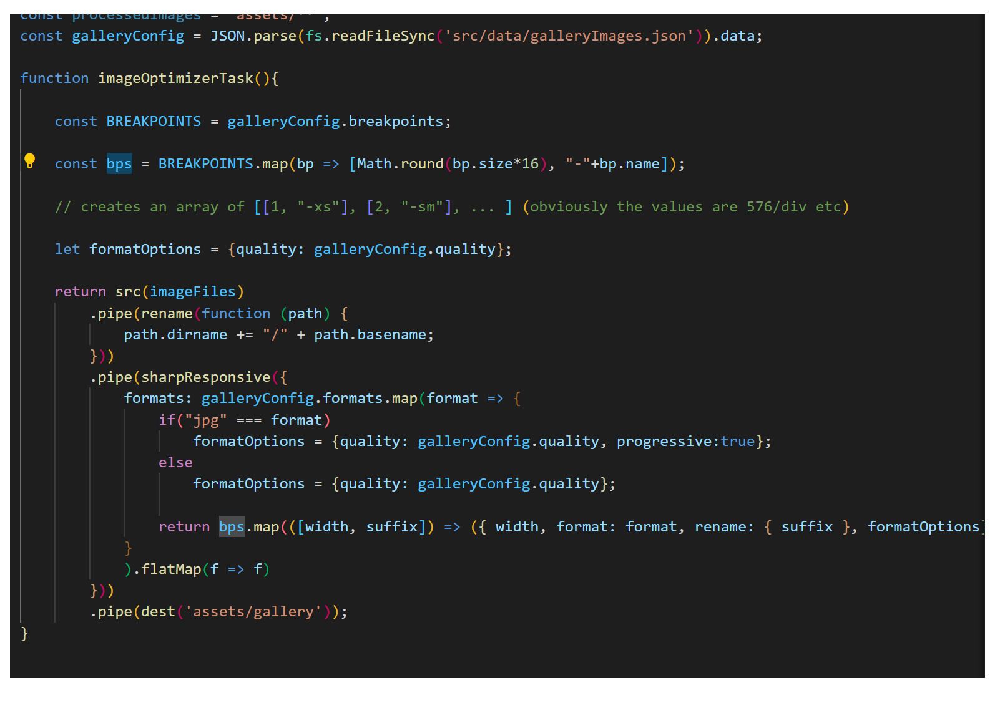

Esta tarea sirve para generar imagenes a partir de una configuración como la de abajo, generara imagenes de tamaños y formatos distintos. En el ejemplo se generarán 6 versiones de cada imagen, dos con terminación **-sm.avif** y **-md.avif**, dos con terminación **-sm.webp** y **-sm.webp**, y dos con **-sm.jpg** y **-md.jpg**. El tamaño de imagen sm equivaldría a 48em * 16 = 768px de ancho y md a 1040px. En el json se encuentra en ems ya que 
se usa el mismo json para generar el html de la hui con la etiqueta de imagen de cada versión, ver más abajo.

    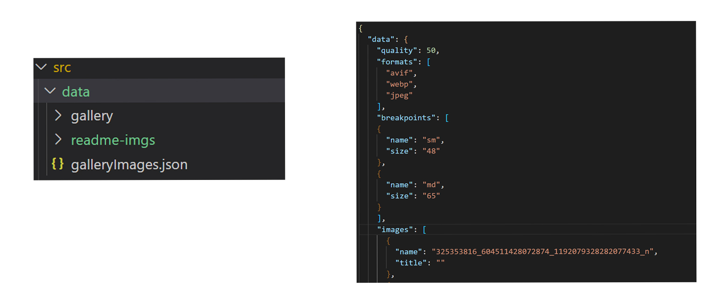

La tarea que optimiza imagenes se ejecuta con la instrucción.

` gulp imageOptimizerTask`

Finalmente veremos como a partir de las imagenes en el directorio **src/data/gallery** y el fichero de configuración **gallery. json** se genera un directorio para cada imagen, con todas las versiones dentro. El nombre del directorio se llama igual que la imagen. 

    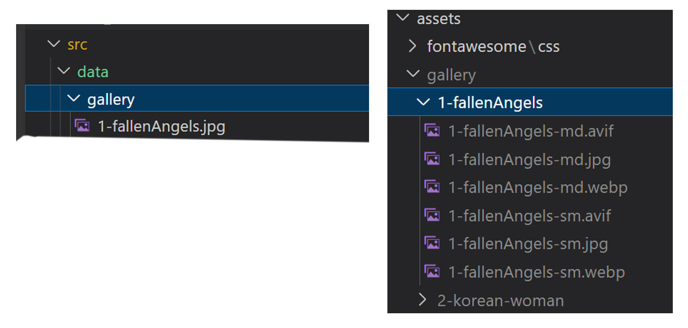

`